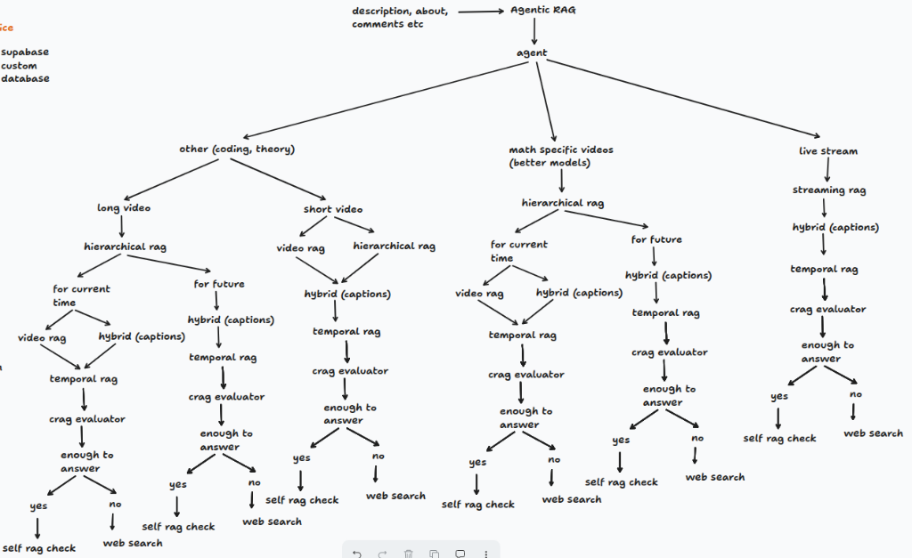
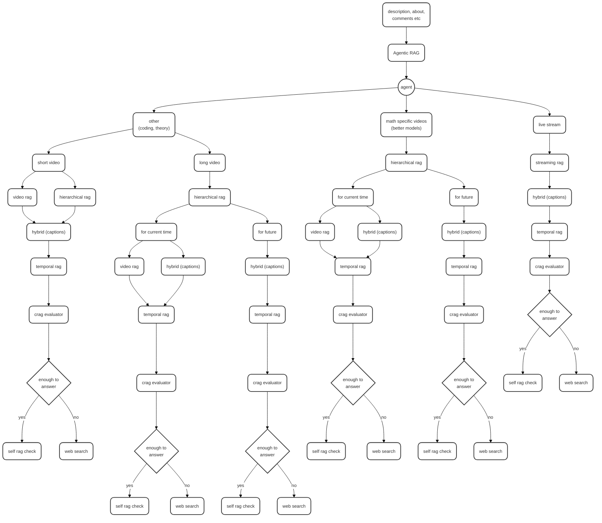

# Simply

Simply is an open-source browser extension and web platform that turns YouTube(as of now) into an interactive learning experience. It's tiring to switch tabs, give the LLM's context and then get the answer for your long educational video and this exact issue is solved by Simply. It acts as an AI teaching assistant that reads video captions in real time, summarizes content and answers your questions directly within your browser.

## How It Works

The architecture is split into three main parts: the browser extension, the backend API and the web frontend.

1. **Browser Extension:** Built with Manifest V3. When you open a YouTube video, the content scripts extract the raw caption data directly from the page. You can open the extension popup to ask a question or request a summary.
2. **Backend API:** A fast Python backend built with FastAPI. It receives the captions, chunks them up and generates vector embeddings using the Hugging Face Inference API (specifically the `BAAI/bge-small-en-v1.5` model). These embeddings are injected into a PostgreSQL database powered by Supabase and `pgvector`.
3. **RAG Pipeline:** When you ask a question, the backend embeds your query, runs a similarity search against the video chunks in the database and sends the most relevant context to the Groq API. Groq then streams back a lightning-fast response based strictly on the video content.
4. **Web Frontend:** A sleek Next.js web app built with React, TypeScript, and Tailwind CSS that handles user authentication, account management, settings, and feature guides.

## Agentic RAG Workflow





### Workflow Pipeline Breakdown

1. **Context Ingestion**:
   - Ingests video metadata (description, about, user comments, and raw caption tracks).
2. **Autonomous Router Agent**:
   - Classifies query and video type into three distinct execution tracks:
     - **Coding & Theory (`other`)**: Split by duration into **short video** and **long video** processing branches.
     - **Math-Specific Videos**: Routed to higher-reasoning models with specialized mathematical hierarchical chunking.
     - **Live Streams**: Handled via dynamic **Streaming RAG** with real-time sliding caption buffers.
3. **Retrieval Architectures**:
   - **Video RAG & Hierarchical RAG**: Multi-level chunk indexing preserves semantic hierarchy and fine-grained visual/audio cues.
   - **Hybrid (Captions)**: Combines dense semantic vector embeddings with keyword/transcript matching.
   - **Temporal RAG**: Aligns extracted information chronologically with video playback timestamps for precise citations.
4. **Evaluation & Verification**:
   - **CRAG (Corrective RAG) Evaluator**: Evaluates retrieved document chunks to determine if the context is sufficient to answer the prompt.
   - **Self-RAG Check**: Performs self-reflection validation to prevent hallucinations and verify answer faithfulness.
   - **Web Search Fallback**: Automatically triggers web search if retrieved video context is insufficient or out-of-scope.

## Tech Stack

- **Frontend:** Next.js (App Router), React, TypeScript, and Tailwind CSS
- **Extension:** JavaScript, CSS, HTML and Manifest V3
- **Backend:** Python, FastAPI and Uvicorn
- **Database:** Supabase (PostgreSQL with `pgvector`)
- **AI Models:** Groq API (LLM generation) and Hugging Face (Embeddings)

## Contributing

Simply is open source and we welcome contributions from anyone! Whether you want to fix a bug, improve the AI pipeline or design a better UI, your help is appreciated.

Here are the steps to get the project running locally so you can start contributing:

### 1. Clone the Repo

First fork the repository to your own GitHub account and clone it to your local machine:

```bash
git clone https://github.com/Shreyasnalle/SIMPLY.git
cd SIMPLY
```

### 2. Set up the Backend

The backend requires Python 3. Navigate to the backend directory, install the dependencies and run the server.

```bash
cd backend
pip install -r requirements.txt
```

You will need to create a `supabase_key.env` file in the backend directory with your API keys:
- `HUGGING_FACE` for the embedding model
- `GROQ_API_KEY` for the LLM
- `SUPABASE_URL` and `SUPABASE_KEY` for your database
- `SUPABASE_DB_URL` for direct postgres connections

Run the backend locally:
```bash
uvicorn main:app --reload --port 8000
```

### 3. Set up the Frontend

The web app is built with Next.js, React, TypeScript, and Tailwind CSS. Navigate to the frontend code directory, install the packages and run the development server.

```bash
cd ../frontend
npm install
npm run dev
```

### 4. Load the Extension

To test changes to the browser extension:
1. Open your browser and go to `chrome://extensions/` or `edge://extensions/`
2. Turn on "Developer's mode"
3. Click "Load unpacked" and select the `chrome-extension` folder in this repository

### 5. Make a Pull Request

Create a new branch for your feature, commit your code and push it to your fork. Then open a pull request on the main repository at [https://github.com/Shreyasnalle/SIMPLY](https://github.com/Shreyasnalle/SIMPLY). We will review it as soon as possible. Long time no see, will be adding cool genai stuff into this project, integrating video + captions + description + title RAG. Integrating PDF, doc and excel provider. Agentic RAG. NotebookLLM. So basically, it will be a overall project specifically for education which will have genai + agenticai.

## License

This project is open source. Check the LICENSE file for more information.
