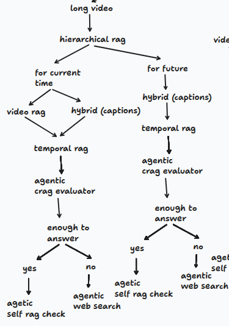
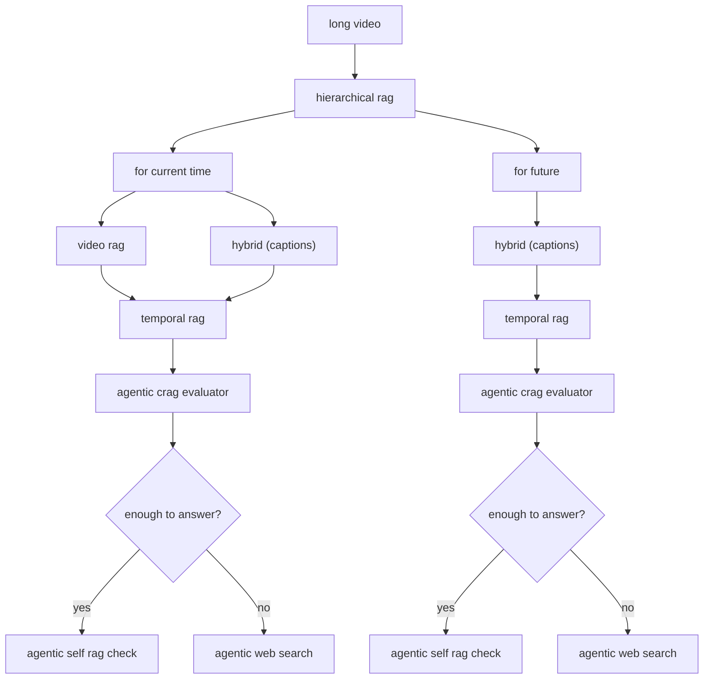

# Backend Technical Specification & Architecture Guidelines

This specification defines the architectural rules, coding standards, and implementation roadmap for the `backend/` directory of the **Simply** platform. All AI agents and developers operating in this backend must strictly adhere to the directives outlined in this document.

---

## 1. Overall Core AI Directives & Guardrails

> [!IMPORTANT]
> The following rules are persistent, non-negotiable instructions that apply across all backend development tasks.

### 1.1 Scope & Directory Containment
- The project structure contains pre-defined architectural folders inside `backend/`:
  - `backend/context_awarness/`
  - `backend/live_streaming/`
  - `backend/mathematical/`
  - `backend/other_videos/`
    - `backend/other_videos/long_video/`
    - `backend/other_videos/short_video/`
- **Strict Rule:** The AI is strictly mandated to write and organize new pipeline code **only within these designated folders**.
- Do not create arbitrary top-level directories or scatter modules across random locations outside this defined directory structure.

### 1.2 Technology Stack
- **Language & Frameworks:** All orchestration, agent graphs, pipelines, and workflows must strictly be built using **Python**, **LangChain**, and **LangGraph**.
- **Backend Serving:** FastAPI and Uvicorn.
- **Database & Storage:** Supabase (PostgreSQL with `pgvector`).
- **Models & Inference:** Groq API (LLM generation) and Hugging Face Inference API (`BAAI/bge-small-en-v1.5` embeddings).

### 1.3 Minimalist, Focused Code Standards
- **No unnecessary print statements:** Do not litter code with ad-hoc `print()` statements.
- **No bloated comments:** Avoid excessive, obvious, or boilerplate commentary. Keep code clean and self-documenting.
- **No speculative fallbacks or bloat:** Do not create fallback functions, defensive layers, or helper abstractions for hypothetical possibilities that have not been explicitly requested.
- **Strict adherence to instructions:** Code strictly within the defined scope and instructions provided. Keep implementations lean, deterministic, and production-grade.

### 1.4 System Overview (Derived from README.md)
Simply is an AI teaching assistant for educational video platforms (starting with YouTube), providing context-aware answers in real-time.
- **State Machine Routing:** The backend functions as a state-based routing engine classifying requests by domain (math vs. other), format (live stream vs. VOD), and duration (long vs. short).
- **Agent Orchestration Roles:**
  - **Supervisor Agent:** Inspects user queries against video metadata and temporal intent to determine the retrieval path.
  - **Critic Agent (CRAG):** Evaluates retrieved context for relevance and completeness, deterministically branching to external web search when context is insufficient.
  - **Self-Reflection Agent (Self-RAG):** Evaluates generator outputs with verification criteria (`[IsSupported]`, `[IsRelevant]`) to ensure answers are grounded and hallucination-free.

---

## 2. Active Implementation Phase: Waterfall 1 — `other_videos/long_video`

The current active development phase focuses strictly on the first waterfall of the Agentic RAG architecture:
- **Target Folder:** `backend/other_videos/long_video/`
- **Target Video Category:** `other_videos` (General educational videos, non-mathematical, pre-recorded VOD)
- **Target Duration:** `long_video` (Videos with extended length requiring hierarchical chunking and temporal resolution)

### 2.1 Workflow Architecture Diagram

---

### 2.2 Pipeline Component Breakdown

The `other_videos/long_video` pipeline is structured into the following operational stages:

#### 1. Hierarchical RAG Entry Point
- Ingests long educational videos where flat vector search over raw chunked text is inefficient and token-heavy.
- Operates on summary-level chapters / macro-chunks to locate relevant conceptual sections before narrowing down.

#### 2. Temporal Intent Classification
The query router categorizes the user request into one of two temporal intents:
- **`for current time`**:
  - Triggered when the user asks a question tied to what is happening at the current video player timestamp (e.g., *"What did he just explain?", "Why did this happen right now?"*).
  - **Retrieval Paths:**
    - `video rag`: Extracts and indexes visual/frame information relevant to the current playback window.
    - `hybrid (captions)`: Combines dense vector similarity with sparse/keyword retrieval over the timestamped transcript.
  - **Temporal Merging (`temporal rag`):** Fuses visual cues and localized caption chunks bounded within the temporal window.
- **`for future`**:
  - Triggered when the user asks forward-looking, broad, or topical questions extending beyond the immediate timestamp (e.g., *"Will this topic cover recursion?", "What is the conclusion of this lecture?"*).
  - **Retrieval Paths:**
    - `hybrid (captions)`: Hierarchical transcript search across remaining/broad video sections.
  - **`temporal rag`**: Aligns retrieved chunks with video timeline markers.

#### 3. Agentic CRAG Evaluator (Corrective RAG Gate)
- Inspects the retrieved context from `temporal rag`.
- Deterministically evaluates relevance and answerability:
  - **`enough to answer: YES`** $\rightarrow$ Proceeds directly to **`agentic self rag check`**.
  - **`enough to answer: NO`** $\rightarrow$ Routes to **`agentic web search`** tool to retrieve missing facts, definitions, or context.

#### 4. Grounding & Self-RAG Check (`agentic self rag check`)
- Verifies that the drafted response is strictly supported by the verified context (either video/captions or search results).
- Filters hallucinations before streaming the final response back to the user.
